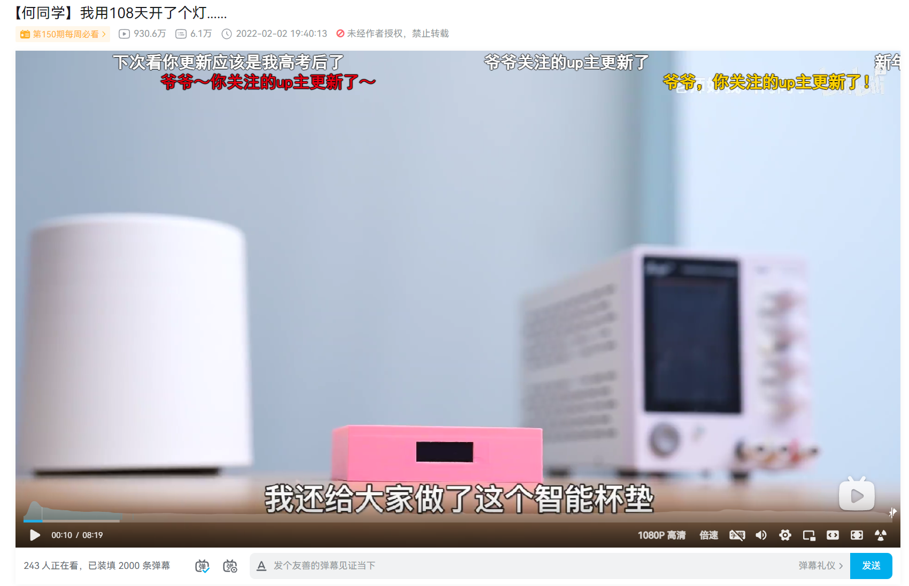
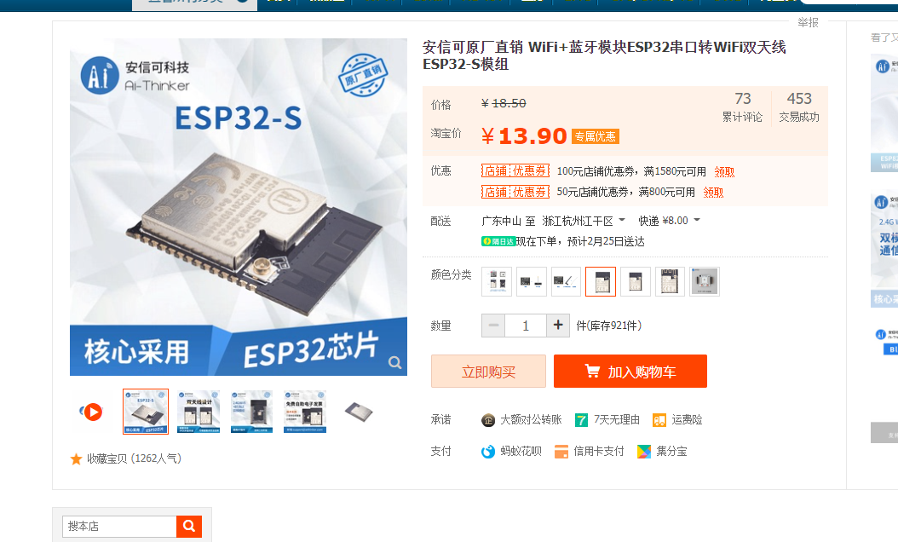
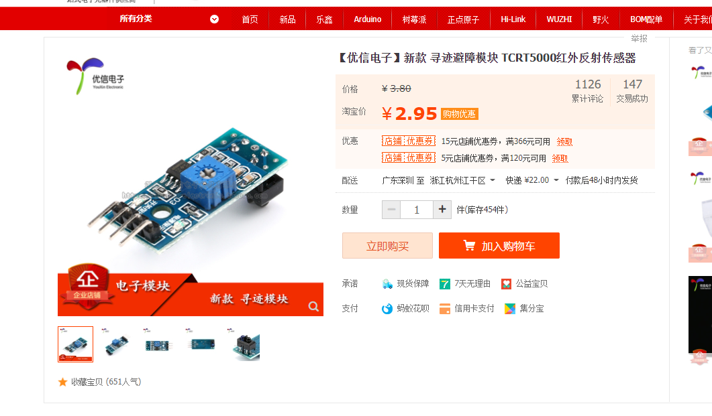
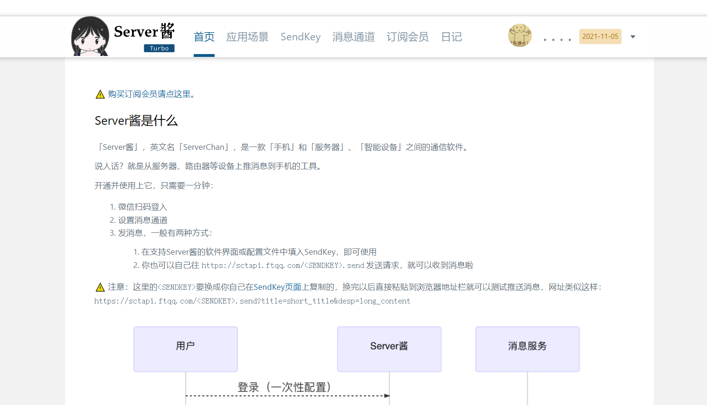
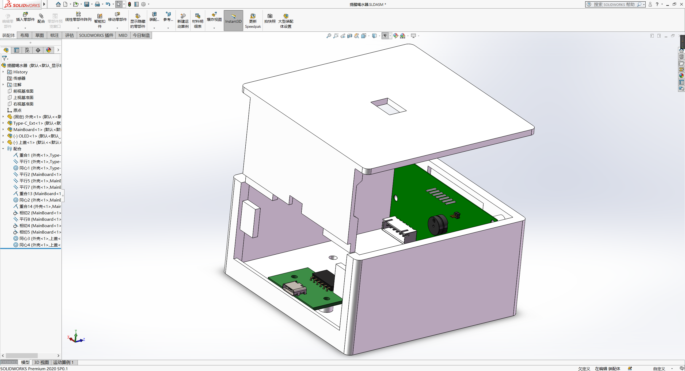
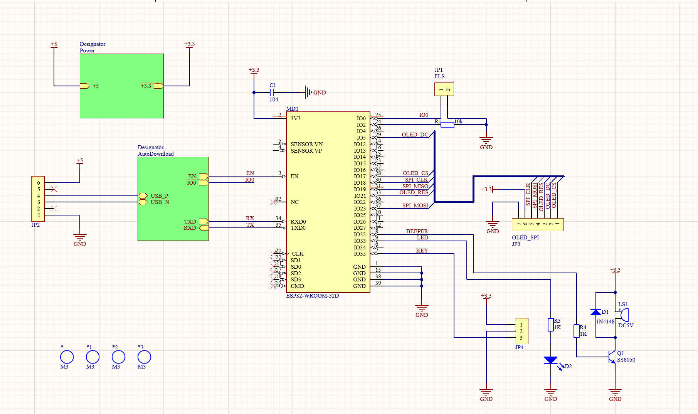
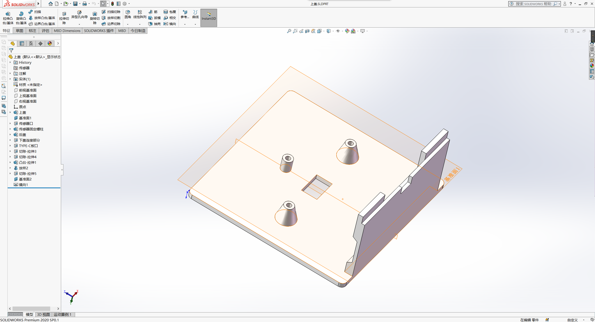
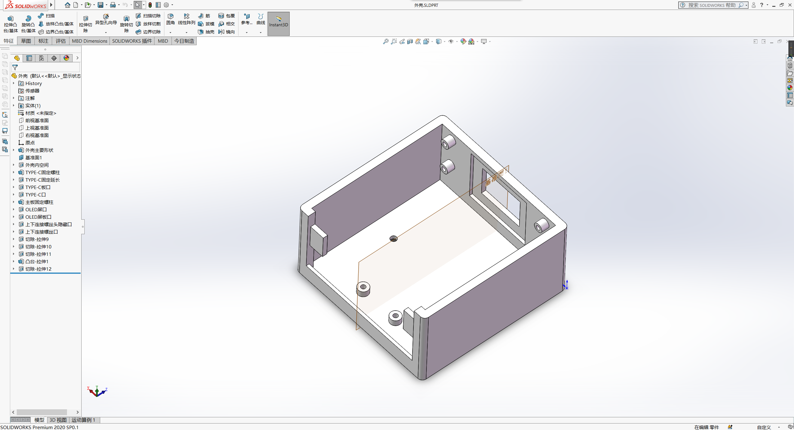

# 提醒喝水器

本项目致力于复刻[何同学视频](https://www.bilibili.com/video/BV1244y1p7kt)中的智能杯垫，并添加更多的功能。~~才不是因为何同学做的开灯方案太没意义呢~~

## 方案设计

* 主芯片使用乐鑫ESP32，能在提供足够的性能的同时提供一个够用的互联网连接

* 检测杯子存在采用光电传感器，价格低廉，识别准确，美中不足需要在外壳上开孔

* 提醒方案采用[Server酱](https://sct.ftqq.com/)的微信推送，同时板载蜂鸣器，可自行修改代码使用

* 外壳采用PETG打印而成，可自行选择其他材料以适应盛放开水的杯子

## PCB设计

PCB使用Altium Designer和KiCAD设计。由于前后距离略长，PCB分为两块，一块为Type-C小板，一块为主PCB，两者通过杜邦线相连。推荐使用XH2.54系列端子以避免潜在的接触不良。推荐使用长度10或15厘米的线材。

## 外壳设计

外壳使用SoildWorks设计（大版本2020）。设计了上盖和底壳，两者通过长螺丝连接。长螺丝推荐使用M3 45mm，其他螺丝推荐使用M3 5mm。对于外壳的修改意见，欢迎提交issue和PR。

## 程序设计

程序基于ESP-IDF框架，并使用Arduino as a ESP-IDF component。预计后期将移除。

程序主要功能为设定报警时间，获取联网信息，获取在线时间并显示，计时杯子存在时间并推送等。

主要流程如下：

todo：流程图

## 效果图

todo
